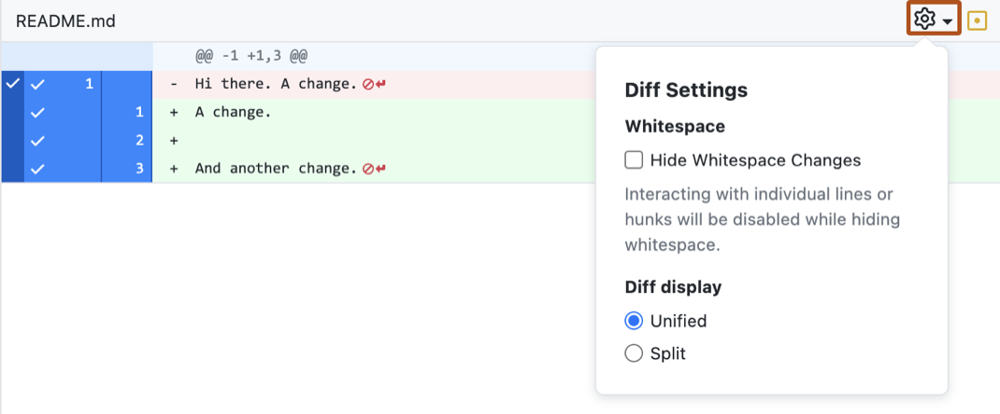

This document presents some general advice about how to **collaborate, manage, store, and communicate** on coding projects related to research.

:::{.callout-note}
This is just general advice! Of course, it depends on the project, the goal to be achieved, and keeping some flexibility is always a good idea!
:::

## AI Use for Researchers

AI use is increasing in all economic sectors, and research is no exception. The AI use is relatively new for research, meaning that all researchers are still experimenting, trying to make the best of these tools, while preventing the windfalls at the corners. First, let's take a look at the different type of AI.

### Agents, chat

Before going further, it is worth clarifying what falls under AI in the context of this guide. Two categories matter for research workflows: chat and agents.

**Chat**

A chat-based AI is a conversational interface: you ask a question or give an instruction, and the model answers within the conversation. It has no ability to act outside of the chat window: it cannot read your files, run your code, or browse your repository. Every exchange is self-contained, and the model only knows what you have explicitly given it, either in the current message or earlier in the same conversation.

**AI agent**

An AI agent goes a step further: it operates *within* an environment, typically a directory on your computer, and can take actions autonomously, such as reading and writing files, running code, executing terminal commands, or calling external tools. Rather than only answering questions, an agent can complete multi-step tasks on its own: for instance, reading a dataset, writing an analysis script, running it, and fixing the errors it encounters, without you having to copy and paste code back and forth. In comparison to a chat, an agent can access to your files and your terminal. It makes it more powerful, but also requires explicit permissions and guardrails.

This distinction matters for research: an agent's ability to access your files directly is precisely what makes it useful for coding tasks, but it is also what requires extra caution, especially when working with confidential data (see the section below).

### General advice

:::{.callout-tip}

Communication is key. You don't have to hide the fact that you use AI, but you do have to **be transparent**. Feel free to talk about your AI practices with your supervisors.

:::

#### Prompting

You have a lot of tutorials about how to improve the efficiency of your prompts when using AI, regardless of the type of AI you use.

1. You have to be precise and concise in what you want.
2. Specify the output format you want. Do you need a dataset in csv, a summary of three lines of something, a file, etc.
3. Try to specify what type of expertise you need, it helps to make the AI more agile on your specific task. "Answer as a R writing expert."
4. Provide the context of your request
5. Small tasks are easier to handle than complex ones. So, it's better to break complex projects into small ones.

#### Agents

For agents such as Claude Code, Codex, Mistral Vibe that operate within a directory, you have to provide context, memory and lines of conduct. Hence, you need to specify files (commonly in Markdown).

1. **PROJECT.md**
   In this file, you'll specify what you want to perform in this project. What's the long term objective, what data you have access to, what are the main packages / coding language you want to use, what are desirable outputs. It is the core of the project you want to work on. Also, you can write some rules to grant or forbid access to specific folders. It defines rules to avoid AI to access data for instance, or run code without your explicit permission. Hence, this file is important to manage the AI behaviour within your folders.

2. **MEMORY.md**
   This file is important. AI does not have memory. Consequently, when AI is called, it does **not** know what was performed previously. Having a memory file is important to work around this. Empirically, you'll ask the AI to write the MEMORY.md file according to what has been performed in each session. By doing so, when you reopen your repo in one or two weeks, you can ask the AI to read the MEMORY.md at the start of the session to provide context.

:::{.callout-note}
PROJECT.md and MEMORY.md are a naming convention suggested here, not a universal standard. Some tools do automatically recognize specific filenames for context (for instance, Claude Code reads `CLAUDE.md`, and Codex reads `AGENTS.md`, at the start of a session). Others don't, and you have to explicitly tell the agent to read your file. Check the documentation of the tool you use to know which filenames, if any, are loaded automatically, and adapt the names accordingly.
:::

#### Check

AI can make mistakes. So you have to find a process to check what AI has been performed, whether it fits your expectation, and whether the results are valid. **Every line of code is your responsibility**, not the AI one. You have to understand what AI is performing. If not, either you ask AI to write it in a way you can understand it, or ask for explanation.

### AI with confidential data

Projects often involve confidential data. As researchers or research assistants, we are responsible for how the data we have access to is used. Consequently, we must be sure that the data is not sent to an AI supplier without proper consent. Let's say you have personal data and that you must comply with the GDPR. In such a case, **coding agents must be used with a high level of caution.** You cannot grant Codex, Claude, or other coding agents data access by default. Consequently, you have to **explicitly** write rules to manage the AI's access, for instance in the PROJECT.md file described above. Moreover, check whether the AI supplier itself complies with GDPR (e.g., data processing agreements, EU-based hosting).

Here are a few measures to avoid sending data to coding agents:

1. Remove data access entirely, if possible.
2. Explicitly instruct the coding agent that it cannot load any data.
3. Create a synthetic sample: a fake dataset that mirrors the structure and distribution of the original data, but contains no real values.

## Sharing code and versioning

Whereas comments on coding scripts, data accessibility, and transparency are the key elements for full reproducibility, the main issue is how to collaborate and have a consistent repository between the collaborators of the project. Let's say that two members work jointly on the coding part; keeping the script up to date for both is challenging. Moreover, let's say that you want to reproduce a figure that was produced six months ago in your script. How is it possible to do it smoothly? 

The key is to have **a shared repository** for all team members. In such a way, every change is transparent and easily accessible. In addition, you need to have all versions of the coding scripts. We present two options for sharing and collaborating on code here. We also summarize the pros and cons of both options. 

:::{.callout-warning}
In this section, we do not talk about storing **data**. We only focus on code. Storing data depends mainly on the regulations that apply. For instance, if you have any confidential data, please make sure to use a data sharing solution that is compliant with the GDPR. For more details, see @sec-data-storing.
:::


+--------------+-----------------------------+----------------------------------+
| Option       | Pros                        | Cons                             |
+==============+=============================+==================================+
| Cloud option | - Easy to implement         | - Difficult to track changes     |
|              | - File version              |                                  |
|              | - Integration with Overleaf |                                  |
+--------------+-----------------------------+----------------------------------+ 
| Github       | - File version              | - Investment cost for all member |
|              | - Easy to track changes     | - Difficult to manage with CASD  |
|              | - Integration with Overleaf |                                  |
+--------------+-----------------------------+----------------------------------+


### Cloud option

The first is the easiest to implement. Using a shared repository in the Cloud, it is possible to share the coding part with all team members, perhaps the entire project (including drafts, reports, and papers). Using a solution such as Dropbox, Nextcloud PSE, or another type, it is easily manageable and works as a classic repository on your laptop.

Currently, most cloud options offer the possibility to access previous versions of a file. Let's say you want to go back to a previous version of your file (to change a very cool graph), you can do that. The only thing is to configure your cloud repo in such a way that it stores all file versions. This might be space-consuming, so you have to be sure that you have enough space to store your files.

However, the main drawback of the simplest solution is that it also offers a limited solution. Let's say that a team member changes something in your coding repository that you want to check. You only know which file is concerned (regarding last modification date), but you do not know **where to look** within the file. You have to check the file entirely and identify the part being changed. If the same thing appears for multiple files, it becomes worse.

:::{.callout-tip}
## Advantages

- Easy to implement
- Can keep all file versions
- Do not require any technical skills
:::

:::{.callout-important}
## Drawbacks

- Identifying changes within the code is tricky
- It becomes worse with a repository with numerous files
:::

### GitHub

GitHub answers the main drawback of the cloud option: identifying changes within a repository. In addition, it registers all changes between two file versions and lists any changes between two updates. Hence, it is easy to track changes and check if everything is right. However, it requires an investment from all team members to manage GitHub.

So, how to use GitHub? You don't need to be a nerd with Terminal applications to manage a GitHub project (you can do it if you want!). The [GitHub Desktop](https://github.com/apps/desktop) enables smoothly managing such a project and provides an interface to easily monitor changes over time.

Let's talk about the main actions for a GitHub project. For setting up a repository, see [here](https://docs.github.com/en/repositories/creating-and-managing-repositories/quickstart-for-repositories). We now have a repository with two team members, such as

```{mermaid}
%%| label: fig-newwgtadj
%%| echo: false
%%| fig-cap: |
%%|   Coding Project (First modification)
%%| fig-width: 12
%%| fig-height: 12
---
config:
  theme: neutral
  max-width: 600
---

flowchart TB;
    A[Member 1] --> B(Project);
    C[Member 2] --> B;
```

Let's say that member 1 works on the project and makes some significant changes in their laptop. For now, **changes made by Member 1 are not shared with Member 2**. It has to **commit** and **push** its changes. 

```{mermaid}
%%| label: fig-newwgtadj2
%%| echo: false
%%| fig-cap: |
%%|   Coding Project (Pushing the modification for the entire team)
%%| fig-width: 12
%%| fig-height: 12
---
config:
  theme: neutral
  max-width: 600
---

flowchart TB;
    A[Member 1] -->|Commit| B;
    C[Member 2] --> B;
```

<!-- B{ shape: procs, label: "Project"} -->

Now, consider that changes made by Member 1 are committed and pushed. The Member 2 wants to work on the project and check the track changes. It has to pull the project from its laptop to see any changes. After that, both repositories are synchronized.

```{mermaid}
%%| label: fig-newwgtadj3
%%| echo: false
%%| fig-cap: |
%%|   Coding Project (Pulling modifications for alternative members)
%%| fig-width: 12
%%| fig-height: 12
---
config:
  theme: neutral
  max-width: 600
---

flowchart LR;
    A[Member 1] --> B(Project);
    B --> |Pull| C[Member 2];
```

In addition, Member 2 can monitor changes being achieved by Member 1 in more detail, without reviewing all the code. Some software offers this possibility, but GitHub Desktop offers good highlights such as



:::{.callout-note}
Here, lines highlighted in green are added by Member 1, whereas lines highlighted in red are removed by Member 1. The stable part of the coding file is uncolored (not applicable here).
:::

In the end, every member can trace back every change in the coding file using the number of the commit. By doing so, it ensures that every version of the coding files is available. Every member can thus generate every figure or table, regardless of which version the figure or table was in. To sum up, the project is composed of numerous evolutions that can be identified by their number, such as


```{mermaid}
%%| label: fig-git
%%| echo: false
%%| fig-cap: |
%%|   Git
%%| fig-width: 12
%%| fig-height: 12
---
config:
  theme: neutral
---

gitGraph
    commit
    commit
    commit
    commit
    commit
    commit
```

Hence, we advise you to put this number in your logfile when making a commit and a significant change in the project. It helps to monitor and follow the evolution of the code.

Finally, the GitHub environment is not accessible in the CASD for security reasons. In the CASD, the repository is shared between all team members. However, there is no system to track changes in code between members. However, it is possible to use Git locally (the software behind GitHub) to monitor code in the same way locally and benefit from versioning and changes highlighting.

:::{.callout-tip}
## Advantages

- Identify changes between files
- Can keep all file versions
:::

:::{.callout-important}
## Drawbacks

- Require some technical investment from all team members
- Not applicable for the CASD
:::

## Integration with Overleaf

[Overleaf](https://www.overleaf.com) is an online text editor widely used in research. From PSE, we get an Overleaf account that enables us to collaborate and write research papers, reports, or notes. It offers the possibility to integrate either Dropbox or GitHub. Hence, running your code automatically updates the repository with your output document (either paper, report, or even slides), making collaboration smoother.

## Data accessibility

The data used for the empirical analysis is key information to provide to ensure consistent and reproducible information. Hence, we need to detail the following information:

- Data source: where can outsiders access the data?
- Data version: for updated datasets, specify the version used in this project (especially for flow data)
- Metadata  

For the metadata, it is useful to list for all team members who might join the project what is being stored in the main datasets. **Ideally**, having a clear explanation of each column, what the observation unit is, whether it is a custom column or derived directly from raw data. In addition, having some units might be of interest as well. It is time-consuming to do so (especially for a large dataset), but it helps a lot for newcomers to understand the data. If an online documentation exists elsewhere, do not hesitate to redirect directly to this website. However, in such a case, please make sure that your columns have the same names as the original data.

## Organizing directory and files

Besides the scripts, structuring a coding directory is also a good practice to have. First, **one script to do everything must be avoided.** Research projects can be large, including some data loading, data management, descriptive statistics, and econometric analysis. One standalone file would be too large to be easily understandable by team members or outsiders.

On the other hand, spread-out files are hard to understand. Let's say you join an ongoing project with multiple files to be handled. How to know which is the first to execute? Order in scripting files is a key element to ensure full reproducibility. Let's say you run the econometric analysis before the filtering step; the results would be dramatically different. Hence, one file must aggregate everything and call each subscript.

We can call this script `main_script` and structure the code as follows (example from an ongoing project)

:::{.panel-tabset}

## R

```{r, eval = FALSE, echo = TRUE}
################################################################################
# Code Preamble
################################################################################

# -----------------------------------------------------------------------------
# Project Information
# -----------------------------------------------------------------------------

# Author:  Author 1, Author 2, Author 3
# Title:   Code of super cool project
# Date:    
# Version: 

# -----------------------------------------------------------------------------
# The log file section can be integrated here with major changes.
# -----------------------------------------------------------------------------

# -----------------------------------------------------------------------------
# Load Necessary Libraries
# -----------------------------------------------------------------------------

# load all relevant packages for the analysis
source("init/packages.R")
theme_update(text = element_text(family = "serif"))
# -----------------------------------------------------------------------------
# Additional Setup or Configuration
# -----------------------------------------------------------------------------

output_table <- "output_code/table/" ## location of table outputs
output_figure <- "output_code/figure/" ## location of figure outputs
choice_w <- 16 # width of the output graphics (in inches)
choice_h <- 9 # height of the output graphics (in inches)

# -----------------------------------------------------------------------------
# Main Code
# -----------------------------------------------------------------------------

################################################################################

# Loading data -----------------------------------------------------------------

source("code/data/01_loading_data.R")
source("code/data/02_filtering_data.R")

# Descriptive statistics about the topic of interest ---------------------------

source("code/descriptive_statistics/01_summary_stat_sample.R")
source("code/descriptive_statistics/02_stat_observation_interest.R")

# Running an econometric analysis ---------------------------------------------

source("code/econometric_analysis/01_diff_in_diff.R")
source("code/econometric_analysis/02_robustness_chekcs.R")
source("code/econometric_analysis/03_placebo.R")
```

## Stata

```{stata, echo = TRUE, eval = FALSE}
* ################################################################################
* Code Preamble
* ################################################################################

* -----------------------------------------------------------------------------
* Project Information
* -----------------------------------------------------------------------------

* Author:  Author 1, Author 2, Author 3
* Title:   Code of super cool project
* Date:    
* Version: 

* -----------------------------------------------------------------------------
* The log file section can be integrated here with major changes.
* -----------------------------------------------------------------------------

* -----------------------------------------------------------------------------
* Load Necessary Libraries
* -----------------------------------------------------------------------------

* In Stata, we typically use `ssc install` or `net install` to install packages.
* For example, to install a package, you might use:
* ssc install package_name

* -----------------------------------------------------------------------------
* Additional Setup or Configuration
* -----------------------------------------------------------------------------

* Define output directories
global output_table "output_code/table/" ## location of table outputs
global output_figure "output_code/figure/" ## location of figure outputs

* Define graphics dimensions
global choice_w = 16 # width of the output graphics (in inches)
global choice_h = 9 # height of the output graphics (in inches)

* -----------------------------------------------------------------------------
* Main Code
* -----------------------------------------------------------------------------

* ################################################################################

* Loading data -----------------------------------------------------------------

do "code/data/01_loading_data.do"
do "code/data/02_filtering_data.do"

* Descriptive statistics about the topic of interest ---------------------------

do "code/descriptive_statistics/01_summary_stat_sample.do"
do "code/descriptive_statistics/02_stat_observation_interest.do"

* Running an econometric analysis ---------------------------------------------

do "code/econometric_analysis/01_diff_in_diff.do"
do "code/econometric_analysis/02_robustness_checks.do"
do "code/econometric_analysis/03_placebo.do"

```

:::

The main script is quite simple to read, regardless of whether you are an R/Stata expert. Remind you that clear code is more likely to be understood by team members. The objective is to provide all the needed steps with some comments to understand each step. The script can be decomposed into different sections.

First, we introduce **a preamble**. We provide the key information about the project, such as the persons involved in it, the date, and the objective of the project. Second, we load everything we need. It avoids loading a package multiple times. Also, it is helpful when you need to provide all relevant packages to be loaded to an alternative member. You can also easily list all your packages when you need to provide the version to ensure full reproducible scripts. Third, we load the data. Then, we run the analysis.

Naming files is an important thing. When you open a coding directory, you want to understand easily how the directory is structured, just as your code. Options differ on how to do it. The first option is to properly structure your main script in a fashion that the number of files is limited and easily understandable, such as `loading_data`, `cleaning_data`, `descriptive_statistics`, and `econometric analysis`. Doing it this way, you know quickly how to look at it if you want to change or add something to your script.  

Another option is to store your subscripts within subdirectories with explicit names such as `descriptive statistics`, `data`, or `econometric_analysis`. It helps to navigate through the directory and understand the code and the underlying choices (which is, in the end, the main thing). Within each subdirectory, we advise you to number the coding files, just to remind you in which order these scripts must be executed. In the same fashion, naming objects within the script should be as clear as possible to ensure team members understand what is what (but remind you that comments are helpful also!).

:::{.callout-note}
The solution you will favor mainly depends on the research team. Setting things at the beginning of the project with the project coordinator, or understanding how the organization works if you join a project, is the best option.
:::

The only advice we can give is to separate data from code, as long as it is possible. Having a repository with script files and a second repository with a dataset is helpful to structure your repository.

:::{.callout-warning}
It is highly advised to separate input data (the original data that you obtain from a data producer) from output data (generated by your script, such as intermediate results). It helps to identify data that can be deleted and easily reproduced from source data.
:::

## Storing data {#sec-data-storing}

The main script is quite simple to read, regardless of whether you are an R expert. GitHub is a platform to share and collaborate on code. But, how about data? Generally speaking, we should avoid storing any data on it for two reasons. First, it relates to the sensitivity of the data. 

To store data securely, you can use the PSE NextCloud solution. Each member of the EU Tax Observatory is a member of [PSE NextCloud](https://pse-nextcloud.pjse.fr/), which offers a Cloud solution for storing files, documents, or data. It is similar to common Cloud services such as Dropbox, but the servers are located in Paris, within PSE. Hence, it provides a way to store and share data between members, which is compliant with the RGPD. You can improve the security level of this repository by adding passwords or time restrictions. 

:::{.callout-note}
In R, there is a package to link your coding repository with your NextCloud data repo.
:::

Besides the storage aspect, it is important to store data in an easily readable format, such as CSV or Parquet, to ensure an easy opening for other members or replicators. Proprietary formats such as Excel should be avoided.

## Additional resources about coding

You can find here some resources:

- [Naming Things in Code](https://www.youtube.com/watch?v=-J3wNP6u5YU) (YouTube Video)
- [Why You Shouldn't Nest Your Code](https://www.youtube.com/watch?v=CFRhGnuXG-4&t=207s) (YouTube Video)
- [Best Practices for Reproducible Code (Utrecht University)](https://utrechtuniversity.github.io/workshop-computational-reproducibility/)
- [WID Guideline for Stata User](docs/wid_stata.pdf)

You can find here some resources related to AI for economic research:


<!--
# Drafting technical documents

# Working practices

**working progress**

Suggestion made by Ninon:

- Add some general advice about how to communicate with the senior researcher-->
